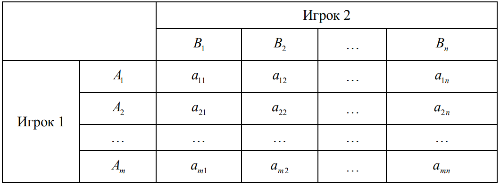
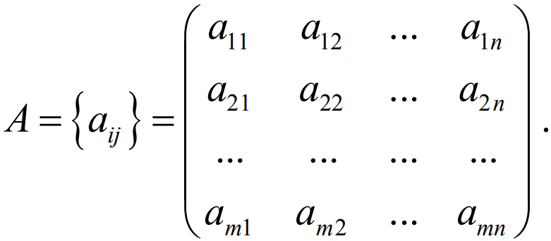
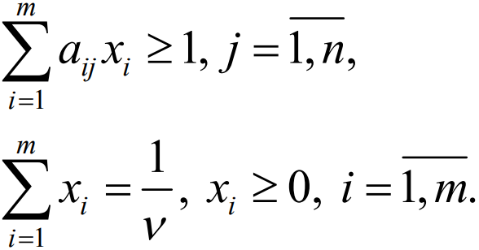
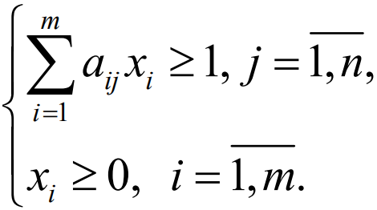
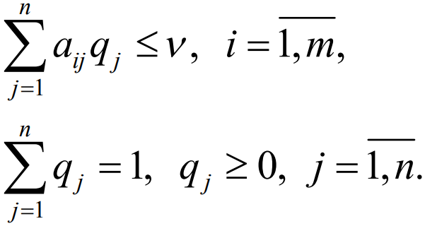
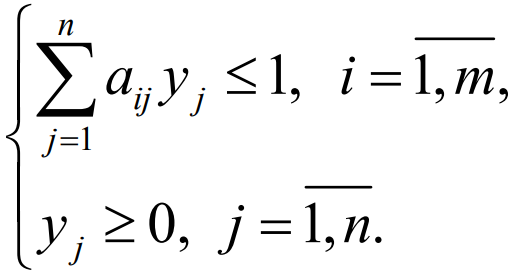

## Постановка задачи

**Задание:** выпонить численное решение антагонистической матричной игры. В часности:
1. написать код, решающий матричную игру путем сведения ее к паре двойственных задач линейного программирования;
2. проиллюстрировать работу данного кода путем визуализации спектров оптимальных стратегий;
3. написать автоматические тесты для решения.

**Цель:** Познакомиться с языком
программирования **Python**, библиотекой **SciPy**, интерактивной средой разработки **Jupyter** и с системой тестирования **Nose**.

---------------------

## Описание задачи и решения

**Матричная игра** — конечная игра двух игроков с нулевой суммой. Предположим, что первый игрок имеет *m* стратегий *A_i* , *i &#8712; [1,m]* , а второй игрок *n* стратегий *B_j* , *j &#8712; [1,n]* . Тогда игра может быть названа игрой *m &#215; n*  или *m &#215; n* игрой. Обозначим через *a_{ij}* значения выигрышей игрока *A* (соответственно — значения проигрышей игрока *B*), если первый игрок выбрал стратегию *A_i*, а второй игрок стратегию *B_j*. В этом случае говорят, что имеет место ситуация {*A_i*, *B_j*}. Значения выигрышей *a_{ij}* (эффективностей) можем представить в виде платежной таблицы, называемой *матрицей игры* или *платежной матрицей*:



Или в виде матрицы:



Рассмотрим игру двух лиц, интересы которых противоположны. Такие игры называют антагонистическими играми двух лиц. В этом случае выигрыш одного игрока равен проигрышу второго, и можно описать только одного из игроков. 
Предполагается, что каждый игрок может выбрать только одно из конечного множества своих действий. Выбор действия называют выбором стратегии игрока. 
Если каждый из игроков выбрал свою стратегию, то эту пару стратегий называют ситуацией игры. Следует заметить, каждый игрок знает, какую стратегию выбрал его противник, т.е. имеет полную информацию о результате выбора противника. 

*Чистой стратегией игрока I* является выбор одной из n строк матрицы выигрышей А, а *чистой стратегией игрока II* является выбор одного из столбцов этой же матрицы.

---

### Этапы решения

**1. Проверка на наличие седловой точки у платежной матрицы.**
Если да, то выписываем решение игры в чистых стратегиях. 
Считаем, что игрок I выбирает свою стратегию так, чтобы получить максимальный свой выигрыш, а игрок II выбирает свою стратегию так, чтобы минимизировать выигрыш игрока I. 

В каждом столбце платежной матрицы определяем макcимальный элемент и среди них находим минимальный - *maxmin*. Пусть этому элементу соответствует чистая стратегия *B_j* игрока *B*.

В каждой строке платежной матрицы определяем минимальный элемент и среди них находим максимальный - *minmax*. Пусть этому элементу соответствует чистая стратегия *A_i* игрока *A* .

Если эти два числа равны, то седловая точка для данной матрицы сущетсвует. Стратегии *A_i* и *B_j* являются оптимальными стратегиями. Решение найдено. Данная ситуация называется *равновесная сиутация {*A_i*,*B_j*}*.

Данному этапу соответствует следующая функция: 

```
def saddle_point(a):

    m = len(a); n = len(a[0])
    min_a = np.zeros(m)
    max_a = np.zeros(n)
    for i in range(m):
        min_a[i] = np.min(a[i])
      
    for j in range(n):
        max_a[j] = np.max(a[:,j])
        
    maxmin = np.max(min_a)
    minmax = np.min(max_a)
    if maxmin == minmax:
        index_max = np.where(min_a == maxmin)[0][0]
        index_min = np.where(max_a == minmax)[0][0]
        return a[index_max], a[:,index_min] 
    return -1, -1
```

Данная функция в качестве аргумента принимает исходную платежную матрицу. Если седловая точка найдена, т.е. если *minmax* = *maxmin*, то функция возвращает соответствующие им чистые стратегии. Иначе, функция возращает *-1*, что символизирует отсутствие седловой точки.

--- 

**2. Проверка платежной матрицы на доминирующие строки и доминирующие столбцы.**

Иногда на основании простого рассмотрения матрицы игры можно сказать, что некоторые чистые стратегии могут войти в оптимальную смешанную стратегию лишь с нулевой вероятностью. 

Говорят, что *i*-я стратегия 1-го игрока доминирует его *k*-ю стратегию, если *a_{ij} &#8805; a_{kj}* для всех *j &#8712; [1,n]* и хотя бы для одного *j* *a_{ij} > a_{kj}*. В этом случае говорят также, что *i*-я стратегия (или строка) – доминирующая, *k*-я – доминируемая. 

Говорят, что *j*-я стратегия 2-го игрока доминирует его *l*-ю стратегию, если для всех *i &#8712; [1,m]* *a_{ij} &#8804; a_{il}* и хотя бы для одного *i* *a_{ij} < a_{il}*. В этом случае *j*-ю стратегию (столбец) называют доминирующей, *l*-ю – доминируемой.

Все доминируемые строки и столбцы следует удалить и соответствующие им вероятности приравнять нулю.

Данному этапу соотвествует следующая функция:

```
def dominant_strategies(a):
    m = len(a); n = len(a[0])
    rows = np.zeros((0))
    cols = np.zeros((0))
    delete = 0
    for i in range(m):
        if i >= m:
            continue
        for j in range(m):
            if j >= m or i >= m:
                continue
            if i != j:
                if np.prod(a[i] >= a[j]) == 1:
                    a = np.delete(a, (j), axis=0)
                    rows = np.append(rows,j + delete)
                    delete += 1
                    m = len(a)
                    j -= 1
                    i -= 1
                    
      
    delete = 0          
    for i in range(n):
        if i >= n:
            continue
        for j in range(n):
            if j >= n or i >= n:
                continue
            if i != j:
                if np.prod(a[:,i] <= a[:,j]) == 1:
                    a = np.delete(a, (j), axis=1)
                    cols = np.append(cols,j+delete)
                    delete += 1
                    n = len(a[0])
                    j -= 1
                    i -= 1
    return a, rows, cols
```  

Данная функция находит и удаляет доминируемые строки и столбцы, а также сохраняет их индексы, чтобы в дальнейшем приравнять соответствующие им вероятности нулю.

---

**3. Находим решение игры в смешанных стратегиях.**

Так как игроки выбирают свои чистые стратегии случайным образом, то выигрыш игрока *I* будет случайной величиной. В этом случае игрок *I* должен выбрать свои смешанные стратегии так, чтобы получить максимальный средний выигрыш. 
Аналогично, игрок *II* должен выбрать свои смешанные стратегии так, чтобы минимизировать математическое ожидание игрока *I*. 

Если в матрице присутствуют отрицательные элементы, то ко всем элементам матрицы следует прибавить абсолютное значение максимального отрицательного элемента. Такая замена не изменит решения игры, изменится только ее цена (по теореме фон Неймана). 

Теперь сведем матричную игру к **паре двойственных задач линейного программирования**. Начнем с первого игрока. Оптимальная смешанная стратегия первого игрока обеспечивает ему средний выигрыш, не меньший цены игры *v*, при любой чистой стратегии второго игрока. То есть будут
выполняться неравенства:


 Если ввести новые переменные по формуле *x_i = p_i / v* то можно получить:



Так как первый игрок стремится максимизировать свой выигрыш *(v &#8594; max)*, то решение матричной игры можно свести к следующей задаче линейного программирования:\\
    Найти **minF(x) = min (x_1 + ... x_m)** при следующих ограничениях:

   

Рассмотрим теперь интересы второго игрока. Его оптималь-
ная смешанная стратегия обеспечивает ему средний проигрыш,
не больший цены игры *v*, при любой чистой стратегии первого игрока. То есть:



Если ввести новые переменные *y_j = q_j / v* то можно получить следующую задачу линейного программирования:\\
   Найти **maxZ(y) = max(y_1 + ... + y_n)** при следующих ограничениях:

Математические модели пары двойственных задач линейного программирования можно записать так: 



---

**4. Симплексный метод.**

Решим прямую задачу линейного программирования симплексным методом, с использованием симплексной таблицы. 

Изначально все свободные члены равны *-1*. Симплексный метод заключается в последовательных итерациях одного и того же алгоритма, который стремится "превратить" все свободные члены в положительные числа. В результате, также полностью положительными будут и элементы индексной (последней) строки.

Суть алгоритма:
1. Среди отрицательных значений базисных переменных выбираем наибольший по модулю. Соответствующая ему строка является ведущей. 
2. Те элементы индексной строки, которые находятся в одной строке с отрицательными элементами ведущей строки, делим на эти элементы и среди этих дробей находим наименьшей по модулю. Соответствующий столбец является ведущим.
3. На пересечении ведущих строки и столбца находится разрешающий (ведущий) элемент. 
4. Выполняем преобразования симплексной таблицы методом Жордано-Гаусса. 

Повторяем этот алгоритм до тех пор, среди свободных членов не останется отрицательных элементов.

Этому этапу соответствует следующая функция:
```
def simplex(s0,indices):
    m = len(s0); n = len(s0[0])
    min_el = np.min(s0[:-1,0])
    if min_el >= 0:
        return 1
    
    leading_row = (np.where(s0[:-1,0] == min_el))[0][0]
    
    min_ = leading_col = 1000
    for i in range(1,n-1):
        if s0[leading_row][i] < 0:
            temp = abs(s0[m-1][i] / s0[leading_row][i])
            if temp < min_:
                min_ = temp
                leading_col = i
    leading_el = s0[leading_row][leading_col]            
    index_col = indices[leading_col-1]
    index_row = indices[leading_row + n - 2]
    indices[leading_col - 1] = index_row
    indices[leading_row + n - 2] = index_col
  
    for j in range(n-1):
        s0[leading_row][j] /= leading_el
    s0[leading_row][leading_col] = 1 / leading_el
    
    for i in range(m):
        s0[i][n-1] = - s0[i][leading_col]
    for i in range(m):
        if i == leading_row:
            continue
        for j in range(n-1):
            if j == leading_col:
                s0[i][j] = s0[leading_row][j] * s0[i][n-1]
            else:
                s0[i][j] += s0[leading_row][j] * s0[i][n-1]           
    return 0
```

Данная функция нахожит ведущие строки, столбцы и соответствующие им элементы, а также осуществляет преобразования симплексной таблицы методом Жордано-Гаусса. 

---

**5. Получение оптимальных стратегий.**

В результате конечного числа итерация, получаем оптимальный план задачи и вычисляем значения *x_i*, *y_j*, где *i = &#8712; [1,m]*, *j = &#8712; [1,n]*. Затем, отсюда находим оптимальные стратегии для каждого из игроков.

---

**6. Визуализация спектров оптимальных стратегий.**

Визуализация спектров оптимальных стратегий осуществляется на основе вычисленной оптимальной стратегии первого игрока. 

Следующая функция осуществляет данный этап:
```
import matplotlib.pyplot as plt

i = 0
x = [i+1 for i in range(len(p))]
i = 0
y1 = [0 for i in range(len(p))]

plt.vlines(x, ymin=y1, ymax=p, color='blue')
plt.scatter(x, p, s=55, color='blue')
plt.show()
```
---

## Инструкция по запуску
1. Открыть Jupyter Notebook.
2. Загрузить файл с кодом *mtx_game.ipynb*

Никаких дополнительных ПО не надо.

---

## Вклад участников

  Студент                  | Вклад
  -------------            | -------------
  Альбатыров Алмаз         | Написание тестов.
  Иванцов Глеб             | Работа с репозиторием. Поиск информации. Написание тестов.
  Сатвальдина Дана         | Написание кода программы. Написание readme.
  
  
## Список литературы
1. Садовин Н.С., Садовина Т.Н. Основы теории игр: учебное пособие / Мар. гос. ун-т;  — Йошкар-Ола, 2011. — 119 с.
2. Васин А.А., Краснощеков П.С., Морозов В.В. Исследование операций - М.: Издательский центр “Академия”.
3. https://math.semestr.ru/games/gamesimplex.php
    

